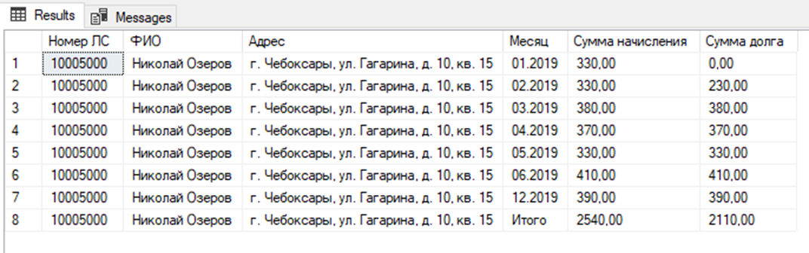
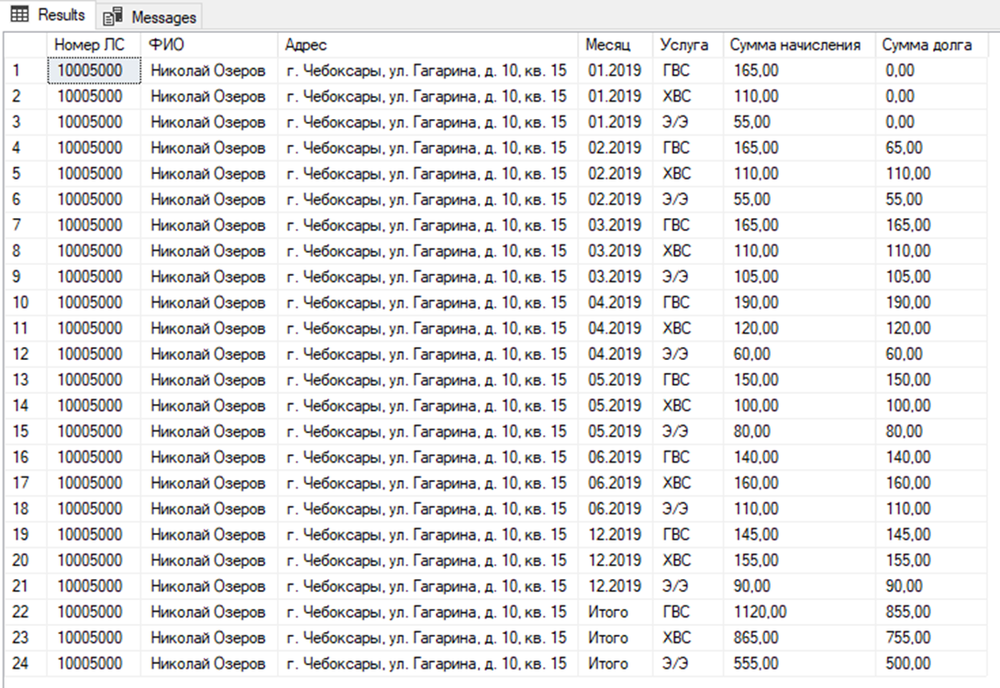
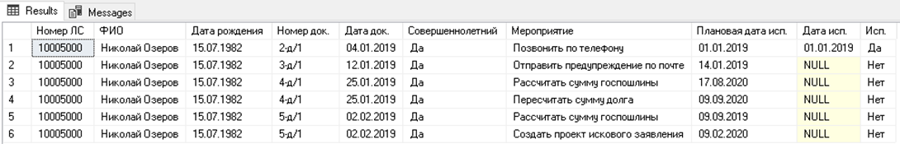
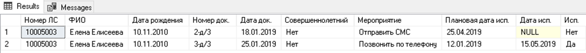
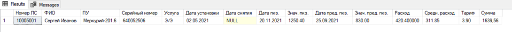
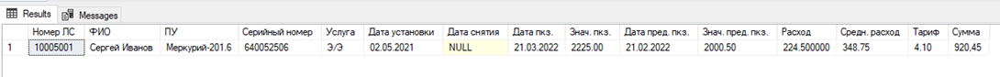

**ВНИМАНИЕ!**

При помощи приложенного скрипта «**ISERVDB.sql**» необходимо создать БД, в которой и будет выполняться задание.

Суть задания заключается в том, чтобы написать функции по пунктам, указанным далее.

Код следует оформить в одном скрипте, в порядке заданий с пояснениями.

---

## 1.  `dbo.RPT_Subscrs_Debts_By_Term`

Требуется написать функцию `dbo.RPT_Subscrs_Debts_By_Term`, которая будет выводить данные о суммах начислений и суммах долга по срокам для указанного лицевого счета на указанную дату в параметрах.

### Параметры:

- `_F_Subscr` – Идентификатор ЛС
- `_D_Date` – Дата, от которой высчитывается срок начисления

### Список колонок:

| Колонка | Описание |
|---------|----------|
| Номер ЛС | Номер ЛС из таблицы лицевых счетов |
| ФИО | ФИО из таблицы лицевых счетов |
| Адрес | Адрес из таблицы лицевых счетов |
| Услуга | Услуга из таблицы начислений |
| Нач. до 30 дней | Сумма начислений со сроком до 30 дней от указанной даты |
| Долг до 30 дней | Сумма долга со сроком до 30 дней от указанной даты |
| Нач. от 31 до 180 дней | Сумма начислений со сроком от 31 до 180 дней от указанной даты |
| Долг от 31 до 180 дней | Сумма долга со сроком от 31 до 180 дней от указанной даты |
| Нач. свыше 181 дня | Сумма начислений со сроком свыше 181 дня от указанной даты |
| Долг свыше 181 дня | Сумма долга со сроком свыше 181 дня от указанной даты |

### Проверки:

#### Проверка №1:

```sql
SELECT * FROM dbo.RPT_Subscrs_Debts_By_Term
      (
        _f_subscr := 1,
        _d_date := '20200301'::date
      );
```

Ожидаемый результат: 


#### Проверка №2:

```sql
SELECT * FROM dbo.RPT_Subscrs_Debts_By_Term
      (
        _f_subscr := 1,
        _d_date   := '20200701'::date
      );
```

Ожидаемый результат: 


---

## 2.  `dbo.RPT_Subscrs_Debts_By_Year`

Требуется написать функцию `dbo.RPT_Subscrs_Debts_By_Year`, которая будет выводить данные о суммах начислений и суммах долга за указанный год для указанного лицевого счета в параметрах по каждому месяцу с одним итогом.

С возможностью посмотреть вывести данные с детализаций по услугам и без.

### Параметры:

- `_f_subscr` – Идентификатор ЛС
- `_n_year` – Год в числовом формате (Например: 2019)
- `_b_detail` – Битовый параметр, выводить детализацию или нет

### Список колонок без детализации:

| Колонка | Описание |
|---------|----------|
| Номер ЛС | Номер ЛС из таблицы лицевых счетов |
| ФИО | ФИО из таблицы лицевых счетов |
| Адрес | Адрес из таблицы лицевых счетов |
| Месяц | Месяц начисления в формате ММ.ГГГГ |
| Сумма начисления | Сумма начислений за месяц |
| Сумма долга | Сумма долга по начислениям за месяц |

### Список колонок с детализацией:

| Колонка | Описание |
|---------|----------|
| Номер ЛС | Номер ЛС из таблицы лицевых счетов |
| ФИО | ФИО из таблицы лицевых счетов |
| Адрес | Адрес из таблицы лицевых счетов |
| Месяц | Месяц начисления в формате ММ.ГГГГ |
| Услуга | Услуга из таблицы начислений |
| Сумма начисления | Сумма начислений за месяц |
| Сумма долга | Сумма долга по начислениям за месяц |

### Проверки:

#### Проверка №1:

```sql
SELECT * FROM dbo.RPT_Subscrs_Debts_By_Year
      (
        _f_subscr := 1,
        _n_year   := 2019,
        _b_detail := FALSE
      );
```

Ожидаемый результат: 



#### Проверка №2:

```sql
SELECT * FROM dbo.RPT_Subscrs_Debts_By_Year
      (
        _f_subscr := 1,
        _n_year   := 2019,
        _b_detail := 1
      );
```

Ожидаемый результат: 



---

## 3.  `dbo.RPT_Subscrs_Docs`

Требуется написать функцию `dbo.RPT_Subscrs_Docs`, которая будет выводить данные о мероприятиях, либо не исполненных, либо исполненных до указанной даты в параметре процедуры, связанных с указанным документом в параметре процедуры и всеми его родительскими документами.

### Параметры:

- `_f_docs` – Идентификатор документа
- `_d_date` – Дата, на которую ищем мероприятия

### Список колонок без детализации:

| Колонка | Описание |
|---------|----------|
| Номер ЛС | Номер ЛС из таблицы лицевых счетов |
| ФИО | ФИО из таблицы лицевых счетов |
| Дата рождения | Дата рождения в формате ДД.ММ.ГГГГ |
| Номер документа | Номер документа из таблицы документов |
| Дата документа | Дата документа из таблицы документов в формате ДД.ММ.ГГГГ |
| Совершеннолетний | Признак показывающий, является ли владелец ЛС совершеннолетним на дату документа |
| Мероприятие | Наименование мероприятия из таблицы мероприятий |
| Плановая дата исполнения | Плановая дата исполнения из таблицы мероприятий в формате ДД.ММ.ГГГГ |
| Дата исполнения | Дата исполнения из таблицы мероприятий в формате ДД.ММ.ГГГГ |
| Признак исполнено | Признак исполнено из таблицы мероприятий |

### Проверки:

#### Проверка №1:

```sql
SELECT * FROM dbo.RPT_Subscrs_Docs
      (
        _f_docs := 9,
        _d_date := '20190102'::date
      );
```

Ожидаемый результат: 



#### Проверка №2:

```sql
SELECT * FROM dbo.RPT_Subscrs_Docs
      (
        _f_docs := 11,
        _d_date := '20190601'::date
      );
```

Ожидаемый результат: 




---

## 4.  `dbo.RPT_Subscrs_Quantity`

Требуется написать функцию `dbo.RPT_Subscrs_Quantity`, которая будет выводить данные о расходе потребления услуг по показаниям на указанную дату по указанному ЛС в параметрах процедуры.

### Параметры:

- `_f_subscr` – Идентификатор ЛС
- `_d_date` – Дата

### Список колонок без детализации:

| Колонка | Описание |
|---------|----------|
| Номер ЛС | Номер ЛС из таблицы лицевых счетов |
| ФИО | ФИО из таблицы лицевых счетов |
| ПУ | Наименование прибора учета из таблицы приборов |
| Серийный номер | Серийный номер из таблицы приборов |
| Услуга | Услуга из таблицы приборов |
| Дата установки | Дата установки ПУ из таблицы приборов в формате ДД.ММ.ГГГГ |
| Дата снятия | Дата снятия ПУ из таблицы приборов в формате ДД.ММ.ГГГГ |
| Дата пкз. | Дата ближайшего показания к указанной дате в параметре _d_date в формате ДД.ММ.ГГГГ |
| Знач. пкз. | Значение ближайшего показания к указанной дате в параметре _d_date |
| Дата пред. пкз. | Дата предыдущего показания к показанию в колонке «Дата пкз.» в формате ДД.ММ.ГГГГ |
| Знач. пред. пкз. | Значение предыдущего показания к показанию в колонке «Дата пкз.» |
| Расход | Разница между значениями текущего показания и предыдущего |
| Средн. расход | Средний расход за последние 12 мес. |
| Тариф | Тариф из таблицы тарифов, актуальный на дату в параметре _d_date для услуги ПУ |
| Сумма | Сумма, вычисляется как Расход * Тариф |

### Проверки:

#### Проверка №1:

```sql
SELECT * FROM dbo.RPT_Subscrs_Quantity
      (
        _f_subscr := 2,
        _d_date   := '20211201'::date
      );
```

Ожидаемый результат:



#### Проверка №2:

```sql
SELECT * FROM dbo.RPT_Subscrs_Quantity
      (
        _f_subscr := 2,
        _d_date   := '20221001'::date
      );
```

Ожидаемый результат: 


